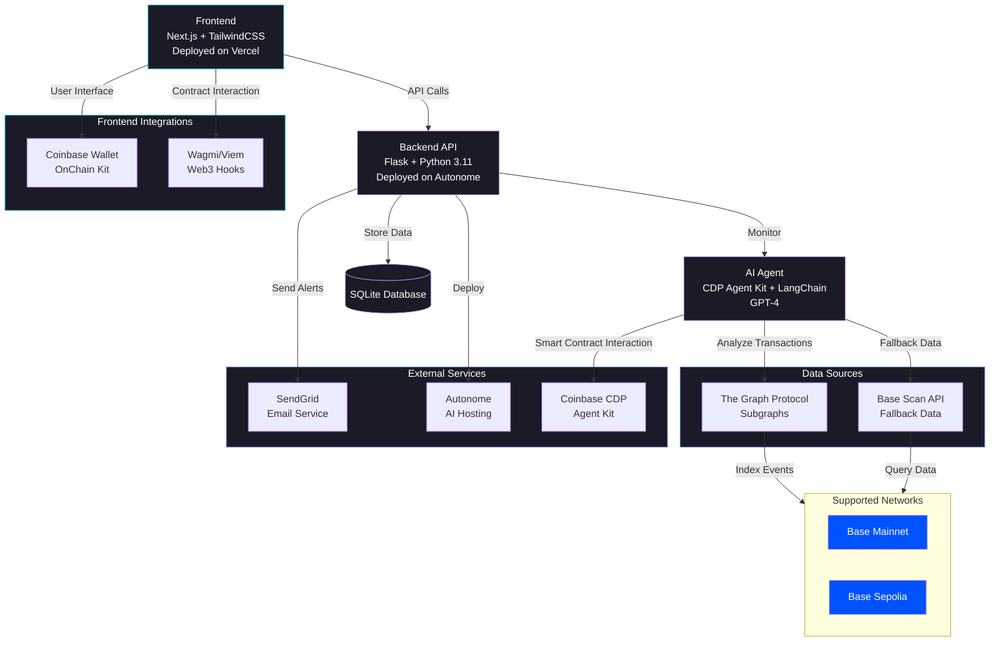

# Aegis Agent: AI-Powered Smart Contract Security Monitor

**Critical Impact**: Projects detecting threats within 1 hour recovered **89%** of funds, while delays beyond 24 hours resulted in only **12%** recovery - highlighting the crucial need for real-time monitoring.

**Important Note**: Aegis is a transaction monitoring system, NOT a smart contract auditing tool. It analyzes on-chain transactions in real-time to detect suspicious patterns and automatically responds to threats using **CDP Agent Kit**. While it cannot detect vulnerabilities in smart contract code, it serves as a critical defense layer by monitoring transaction behavior and enabling rapid response through automated alerts and contract pausing.

---

### **Overview**  
**Problem**: Smart contracts are vulnerable to hacks due to lack of real-time monitoring and delayed threat response.  
**Solution**: An AI-driven agent that monitors **transactions 24/7**, detects anomalies, and triggers alerts/emergency actions.  

---

### **Why This Wins?**  
Combines AI's predictive power with blockchain's transparency to create a defense system that evolves with new threats. Targets the $10B+ lost annually to DeFi hacks.  

Here's a curated list of major DeFi hacks with attack vectors, losses, and response times, showing how AI monitoring system could help:

---

**Major DeFi Hacks Analysis**  
| **Attack**             | **Year** | **Attack Vector**           | **Funds Lost** | **Detection Time** | **Response Time** | **Outcome** |  
|-------------------------|----------|------------------------------|----------------|--------------------|-------------------|-------------|  
| **The DAO Hack**         | 2016     | Reentrancy Attack            | $60M           | 3 days             | 14 days           | Hard fork   |  
| **Parity Wallet Hack**   | 2017     | Access Control Flaw          | $30M           | 4 hours            | 48 hours          | Unrecovered |  
| **dForce Hack**          | 2020     | Reentrancy + Oracle Manip.   | $25M           | 12 hours           | 3 days            | Recovered   |  
| **Poly Network Exploit** | 2021     | Cross-Chain Vulnerability    | $611M          | 1 hour             | 7 days            | Returned    |  
| **Ronin Bridge Hack**    | 2022     | Compromised Private Keys     | $625M          | 6 days             | 15 days           | Unrecovered |  
| **Wormhole Hack**        | 2022     | Signature Verification Flaw  | $325M          | Immediate          | 3 days            | Bailout     |  
| **Beanstalk Flash Loan** | 2022     | Governance Manipulation      | $182M          | 15 minutes         | 2 hours           | Unrecovered |  
| **Euler Finance**        | 2023     | Flash Loan + Donation Attack | $197M          | 8 hours            | 3 weeks           | Recovered   |  
| **Mixin Network**        | 2023     | Database Breach              | $200M          | 2 hours            | Ongoing           | Unresolved  |  


---

### **How AI System Would Help**  
| **Attack Type**          | **Solution's Mitigation** |  
|--------------------------|---------------------------------|  
| **Reentrancy**           | Block suspicious tx patterns in <30 sec |  
| **Flash Loans**          | Flag unusual liquidity movements |  
| **Oracle Manipulation**  | Cross-check 5+ price feeds |  
| **Access Control**       | Monitor admin function calls |  
| **Signature Flaws**      | Validate contract bytecode changes |  
  
---

### **Technical Architecture**



#### **Component Details**

1. **Frontend Layer**
   - **Framework**: Next.js 14 with App Router
   - **Key Components**:
     - Wallet Connection (Coinbase OnChain Kit)
     - Real-time LogsViewer
     - Contract Management Forms
     - Dashboard Analytics
   - **Styling**: TailwindCSS with custom dark theme
   - **State Management**: React Query + Custom Hooks

2. **Backend Services**
   - **API Server**: Flask with Python 3.11
   - **Database**: SQLite with SQLAlchemy ORM
   - **Key Services**:
     - Autonomous Monitor Service
     - AI Security Agent
     - Contract Event Processor
     - Alert Management System

3. **Blockchain Integration**
   - **Networks Supported**:
     - Ethereum Mainnet
     - Base Mainnet
     - Base Sepolia
   - **Tools**:
     - CDP Agent Kit for contract interaction
     - The Graph Protocol for event indexing
     - Base/Etherscan APIs as fallback

4. **External Services**
   - **Email**: SendGrid for alert notifications
   - **AI Agent Hosting**: Autonome for agent deployment
   - **Block Explorers**: Base/Etherscan APIs

#### **Data Flow**

1. **Contract Monitoring**
   ```mermaid
   sequenceDiagram
       participant Contract
       participant Graph
       participant Agent
       participant Email
       
       Contract->>Graph: Emit Event
       Graph->>Agent: Index & Forward
       Agent->>Agent: Analyze Threat
       alt High Risk
           Agent->>Contract: Pause
           Agent->>Email: Send Alert
       else Safe
           Agent->>Graph: Continue Monitoring
       end
   ```

2. **Alert System**
   ```mermaid
   sequenceDiagram
       participant Monitor
       participant Agent
       participant DB
       participant Email
       participant UI
       
       Monitor->>Agent: Detect Threat
       Agent->>DB: Log Threat
       Agent->>Email: Send Alert
       Agent->>UI: Update Status
       UI->>DB: Fetch Logs
   ```

---

### **Predicted Success Metrics**  
- **Detection Accuracy**: >95% true positive rate.  
- **Latency**: <30 sec from transaction to alert.  
- **User Experience**: <2 clicks to configure monitoring.  
- **Security**: Zero exposed private keys.  

---

### **Risks & Mitigation**  
- **False Positives**: Human-in-the-loop confirmation.  
- **Scalability**: Rate-limited API calls + caching.  
- **Chain Reorgs**: 12-block confirmation depth.  

---

### **Future Roadmap**  
- MEV protection module  
- Mobile app with push notifications  
- On-chain insurance integration  
- Decentralized threat intelligence network  

---

### **How to Run Locally**

#### Backend Setup
```bash
# Navigate to backend directory
cd backend

# Create and activate Python virtual environment
python3.11 -m venv venv
source venv/bin/activate  # On Windows: venv\Scripts\activate

# Install dependencies
pip install -r requirements.txt

# Create .env file with required variables
cp .env.example .env
# Update .env with your values:
# ETH_RPC_URL=
# BASE_RPC_URL=
# BASE_SEPOLIA_RPC_URL=
# SMTP_SERVER=
# SMTP_PORT=
# SMTP_USERNAME=
# SMTP_PASSWORD=

# Run the server
python3.11 index.py
```

#### Frontend Setup
```bash
# Navigate to root directory
cd ..

# Install dependencies
npm install

# Create .env file with required variables
cp .env.example .env
# Update NEXT_PUBLIC_WC_PROJECT_ID in .env

# Run the development server
npm run dev
```

The frontend will be available at `http://localhost:3000` and the backend at `http://localhost:5000`
---

